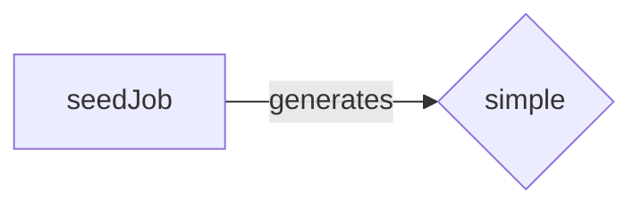
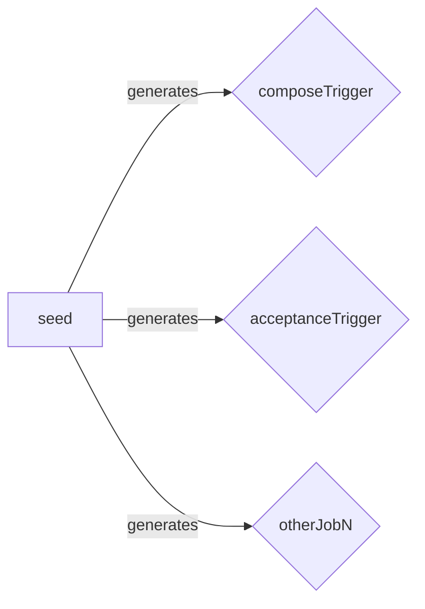

# Setting up seed job with the Job DSL


## Prerequisites
1. [Download and run Jenkins](https://jenkins.io/doc/pipeline/tour/getting-started/)
    1. Download Jenkins.
    2. Open up a terminal in the download directory.
    3. Run `java -jar jenkins.war --httpPort=8080`.
    4. Browse to `http://localhost:8080`.
    5. Follow the instructions to complete the installation.
2. Familiarity with Jenkins Pipeline.

## Part 1. Proof of concept
Now that the prerequisites are out of the way, the first thing we are going to do is set up a  simple proof of concept **Freestyle project** (`seedJob`) in Jenkins. This job will be used to generate other jobs you want to on-board into Jenkins.



#### 1 Install the  `Job DSL`  plugin
Navigate to `http://localhost:8080/` in your browser and login to Jenkins with the credentials you set up. We need to configure Jenkins to use the Jenkins Job DSL API.
-  Navigate to  `Dashboard`  >  `Manage Jenkins`  >  `Manage Plugins`  > select  `Available`  tab > search for  `Job DSL`  and install.

#### 2 Creating the Freestyle Project  `seedJob`
We will set up our  `seedJob`  the same way any other job is created.

1.  On the left hand side of the page, select  `New Item`
2.  In the text box for  `Enter an item name`, enter  `seedJob`  > select the  `Freestyle project`  > select  `OK`.


#### Configure  `seedJob`  to use  `hola-jenkins`github repository
Now we are going to store the code for our `seedJob` in a github repository called `hola-jenkins`. Since we are using the `hola-jenkins` repository to load `seed.groovy`, we need to configure `seedJob` to use this repository.

1.  Navigate to  `Dashboard`  > select  `seedJob`  > select  `Configure`.
2.  Scroll to the  `Source Code Management`  section > select  `Git`.
3.  In the  `Repository URL`  field, enter  [`https://github.com/hereischen/hola-jenkins`](https://github.com/hereischen/hola-jenkins).
    -   Leave everything else as the default configuration.
 

#### Configure  `seedJob`  to use the  `seed.groovy`  file we will store in github

Now that we have configured Jenkins to use our `hola-jenkins` repository, we need to set up `seedJob` to load `seed.groovy` from our `hola-jenkins` repository. This is necessary for us to start using the Jenkins Job DSL API functionality.

Since we will be using our  `hola-jenkins`  repository, we will need to add some additional configuration to the  `seedJob`  to get this working.

1.  Navigate to  `Dashboard`  > select  `seedJob`  > select  `Configure`.
2.  Scroll to the  `Build`  section > select  `Add Build step`  > Select  `Process Job DSLs`.
3.  Select  `Look on Filesystem`.
4.  In the  `DSL Scripts`  input field, enter  `dsl/seed.groovy`  (this is the path to the  `seed.groovy`file we will be setting up later).
    -   Leave everything else as the default configuration
 

#### Configure  `seedJob`  to take a parameter as the job name
We will give our job the name when we plan to build (`simpleJob`). In order to do this we will need to add a `String parameter` to the `seedJob` that will be used inside of `seed.groovy`.

1.  Navigate to  `Dashboard`  > select  `seedJob`  > select  `Configure`  .
2.  Select  `This project is parameterized`  > select  `Add Parameter`  > select  `String Parameter`.
3.  Enter  `jobName`  in  `Name`  field.
4.  In the  `Description`  field, enter  `The name of your repo`.


#### Creating a simple demo Freestyle job
We are using the  [`hola-jenkins`](https://github.com/hereischen/hola-jenkins)  github repository. This repository will be used to store our  `seed`  code. Later, we will include our Shared Library code in this repository.

1.  Inside of the  `hola-jenkins`  repository, we have created a directory  `dsl`  with  `seed.groovy`  inside.
    -   [`hola-jenkins/dsl/seed.groovy`](https://github.com/hereischen/hola-jenkins/blob/master/dsl/seed.groovy).
2.  Below are the contents of  `seed.groovy`.
    -   We create a simple Freestyle Job and use the  `String Param`  named  `jobName`  from  `seedJob`  to name our Freestyle job.
```groovy
job(jobName) {
    description("A simple Freestyle Job generated from seed.groovy")
}
```

#### Running the  `seedJob`
Now that we have our `seedJob` setup to read in `seed.groovy` from our github `hola-jenkins` repository, we are ready to trigger our `seedJob` to create a Freestyle job with `jobName`
1.  Navigate to  `Dashboard`  > select  `seedJob`  > select  `Build Now`.
2.  Under  `Build History`, select the top red circle.
3.  This will take you to the  `Console Output`.
    -   The job  **failed**.
    -   Due to  [Script Security](https://github.com/jenkinsci/job-dsl-plugin/wiki/Script-Security), this will happen every time you change  `seed.groovy`. The  [Script Security Plugin](https://plugins.jenkins.io/script-security)  is integrated with the  `Job DSL`  plugin and the Script Security Plugin is set up with a set of scripts that are pre approved for use. Since this is a new script, it will require an admin approval to use.


#### Approving our `seed.groovy`  script
We need to tell Jenkins it is ok to use this script.
-   Navigate to  `Dashboard`  >  `Manage Jenkins`  >  `In-process Script Approval`.
-   Select  `Approve`  for the  `seed.groovy`  script.

Note:
We can apply **[configuration-as-code-plugin](https://github.com/jenkinsci/configuration-as-code-plugin)** to by pass this behavior by adding a [`hola-jenkins/jenkins.yaml`](https://github.com/hereischen/hola-jenkins/blob/master/jenkins.yaml). in our `hola-jenkins` repository.
```yaml
security:

globalJobDslSecurityConfiguration:

# Otherwise Job DSL either requires script approval or having all config whitelisted

# https://github.com/jenkinsci/job-dsl-plugin/wiki/Script-Security

useScriptSecurity: false
```
Consult [`JCasC`](https://github.com/jenkinsci/configuration-as-code-plugin) for more information.

#### Rerunning the  `seedJob`

Now that we have approved  `seed.groovy`, we are ready for our  `seedJob`  to run (and succeed).

1.  Navigate to  `Dashboard`  > select  `seedJob`  > select  `Build Now`.
2.  Under  `Build History`, select the top blue circle.
3.  Inside of  `Console Output`, you will see  `GeneratedJob{name='freestyle'}`.
    -   Jenkins has created a new job called  `simple`  from`seed.groovy`.


## Part 2. One implementation

#### Introduction
In this second part, we will be setting up a  [Jenkins Shared library](https://jenkins.io/doc/book/pipeline/shared-libraries/)  to execute our Jenkins jobs. As the complexity and number of jobs you maintain grow, the use of Shared Libraries provides the ability to share and reuse code across jobs for CI and CD processes.

In order to set up a practical application with our  `seed`, we will modify  `seed.groovy`  to build a `Pipeline job` (`composeTrigger`)  from a file named [`composeTrigger`](https://github.com/hereischen/hola-jenkins/blob/new-imp/vars/jobs/composeTrigger) in Shared Libraries. 


#### Configure default Shared Library set up for Jenkins
Since we will be using a Shared library, Jenkins needs to be set up to use our Shared Library.

1.  Navigate to  `Dashboard`  > select  `Manage Jenkins`  > select  `Configure System`  > scroll down to  `Global Pipeline Libraries`  > select  `Add`
2.  Enter  `hola-jenkins`  in the  `Name`  field
3.  Enter  `new-imp`  in  `Default Version`
    -   This tells jenkins which branch of our Shared Library we plan to use by default.
4.  Under  `Source Code Management`, select  `Git`
5.  In the  `Project Repository`  field, enter  `https://github.com/hereischen/hola-jenkins`  > select  `Save`.


#### Create `seed`  to use a  `new-imp`  branch we will create in  `hola-jenkins`
Create a new job DSL named `seed`, just like what we did in session 1.2. Under `Source Code Management`, change the `Branch Specifier` to `*/new-imp`


1.  Create a new branch  `new-imp`  in  `hola-jenkins`.
2.  In the  `new-imp`  branch, remove the original code in  `seed.groovy`  and paste in from [`seed.groovy`](https://github.com/hereischen/hola-jenkins/blob/new-imp/seed.groovy). This script loads jobs from `/vars/jobs` and builds each job using its file name as the job name.
    -   For a better understanding of the  `pipelineJob` , make sure to go back and check the  [Jenkins Job DSL API](https://jenkinsci.github.io/job-dsl-plugin/#).
3. Create a new file named [`composeTrigger`](https://github.com/hereischen/hola-jenkins/blob/new-imp/vars/jobs/composeTrigger)(This will be the job name) under `vars/jobs` 

#### Running the  `seed`
All of our configuration is set up and our repository is ready to use. We will now run our `seed` to create our `composeTrigger` based on our `seed.groovy` set up.
1. Navigate to `Dashboard` > select `seedJob` -> select `Build now`


