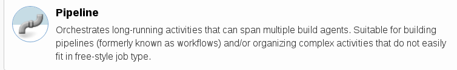
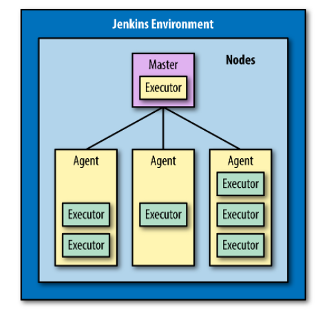
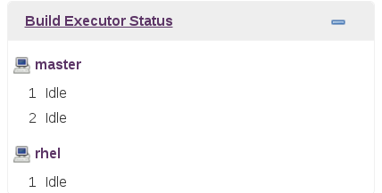
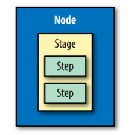
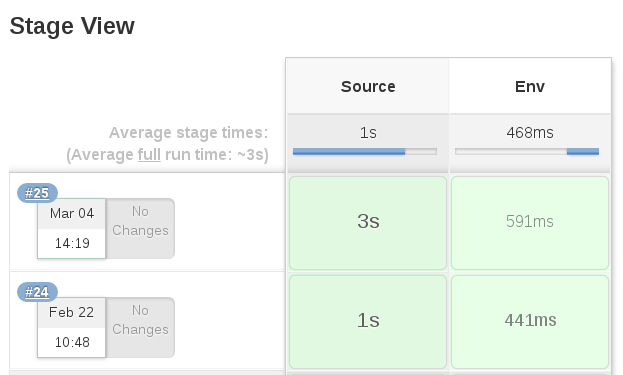

# Non Definitive Beginner's Guide to Jenkins 2

## What is Jenkins 2?
> Jenkins is a self-contained, open source automation server which can
> be used to automate all sorts of tasks related to building, testing,
> and delivering or deploying software.

Jenkins 2 is a newer versions of Jenkins that directly incorporate support for
`pipelines-as-code` and other new features such as Jenkinsfiles.

Instead of filling in web forms to define jobs for Jenkins, users can now write programs using the Jenkins DSL and Groovy to define their pipelines and do other tasks.

DSL here refers to `Domain-Specific Language`, the “programming language” for Jenkins. The DSL is Groovy-based and it includes terms and constructs that encapsulate Jenkins-specific functionality.

#### Pipeline

The Pipeline type of project is intended for creating pipelines.




This is done by writing the code in the Jenkins DSL.Pipelines can either be written in a “scripted” syntax style or a “declarative” syntax style. Pipelines created in this type of project can also be made easily into Jenkinsfiles.

So you can think it like this:

 

## The Foundations

#### Syntax: Scripted Pipelines Versus Declarative Pipelines
`Scripted Pipelines` are more like scripts or programs
written in any imperative language to execute the program flow and logic

`Declarative Pipelines` are more like what was traditionally done in Jenkins if you were using the web forms—filling in key information in predefined sections that have a predefined purpose and expected behavior. 

```groovy
// Scripted Pipeline
def err = null
try {
    node('node1') {
        stage('Source') { // Get code
            ...
        }
        stage('Compile') { // Compile and do unit testing
            ...
        }
    }
}
catch (err) {
    currentBuild.result = "FAILURE"
}
finally {
(currentBuild.result != "ABORTED"){
    // Send email notifications for builds that failed
    // or are unstable
    }
}

// Declarative Pipeline
pipeline {
    agent {label 'node1'}
    stages {
        stage('Source') { // Get code
            steps {
                ...
                }
            }
        stage('Compile') { // Compile and do unit testing
            steps {
                ...
            }
        }
    }
    post {
        always {
            echo "Build stage complete"
        }
        failure {
            echo "Build failed"
            mail body: 'build failed', subject: 'Build failed!',
            to: 'xxx@redhat.com'
        }
    }
}
```

#### Systems: Masters, Nodes, Agents, and Executors

`Master`: A Jenkins master is the primary controlling system for a Jenkins instance. It has complete access to all Jenkins configuration and options and the full list of jobs. It is the default location for executing jobs if another system is not specified.
It is not intended for running any heavyweight tasks. 
A master should not have potentially blocking operations executed on it

`Node`: A node is a machine which is part of the Jenkins environment and is capable of executing a Pipeline

`Agent`: This refers to any non-master system. They are managed by the master system and allocated as needed, or as specified, to handle processing the individual jobs.

`Executor`: An executor is just a slot in which to run a job on a node/agent. A node can have zero or more executors. The number of executors defines how many concurrent jobs can be run on that node.




#### Structure: Outlines of the Jenkinsfile

`Node`: This line tells Jenkins on which node it should run this part of the pipeline. It binds
the code to the particular Jenkins agent program running on that node.
```groovy
node("rhel && beijing"){...}
```
Note that you can omit supplying a label here:
 - If master has been configured as the default node for execution, Jenkins will run the job on master . ( master can be configured to not run any jobs.)
 - Otherwise, an empty node label (or agent any in declarative syntax) will tell Jenkins to run on the first executor that becomes available on any node.

`Stage`: Within a node definition, a stage closure allows us to group together individual settings, DSL commands, and logic. A stage is required to have a name , which provides a mechanism for describing what the stage does.

`Step`: Inside the stage, it is the actual Jenkins DSL commands. These are referred to as steps in Jenkins terminology. A step is the lowest level of functionality defined by the DSL. 




## Reference:

 1. [Jenkins User Documentation](https://jenkins.io/doc/)
 2. [Jenkins 2: Up and Running](https://www.oreilly.com/library/view/jenkins-2-up/9781491979587/)
